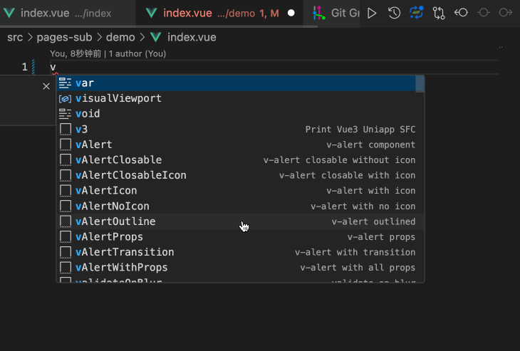

  

<h1 align="center">
  <a href="https://github.com/codercup/unibest" target="_blank">早早集市 - app - 小程序</a>
</h1>

<b></b>

## ✨ 特性

- ⚡️ [Vue 3](https://github.com/vuejs/core), [Vite](https://github.com/vitejs/vite), [pnpm](https://pnpm.io/), [esbuild](https://github.com/evanw/esbuild) - 就是快！

- 🔥 最新语法：使用新的 `<script setup>` 语法

- 🎨 [UnoCSS](https://unocss.dev/) - 高性能且极具灵活性的即时原子化 CSS 引擎

- 🍍 [pinia](https://pinia.vuejs.org/) & [pinia-plugin-persistedstate](https://prazdevs.github.io/pinia-plugin-persistedstate/zh/guide/) - 全端适配的全局数据管理

- 🦾 [TypeScript](https://www.typescriptlang.org/) & [ESLint](https://eslint.org/) & [stylelint](https://stylelint.io/) - 保证代码质量

- 😃 [UnoCSS Icons](https://unocss.dev/presets/icons) & [icones](https://icones.js.org/) - 海量图标供你选择

- 📦 [组件自动化加载](./src/components) - 可配置化的组件加载方式，轻松加载组件

- 📥 [API 自动加载](https://github.com/antfu/unplugin-auto-import) - 直接使用 Composition API 无需引入

- 🌈 [husky](https://typicode.github.io/husky/) & [lint-staged](https://github.com/lint-staged/lint-staged) + [commitlint](https://commitlint.js.org/) - 保证代码提交质量

- 🎉 `v3` Code Snippets 加快你的页面生成

- 🗂 `uni.request` 请求封装 & 请求拦截，一键引入，快捷使用

- 💡 ES6 import 顺序自动排序，css 属性自动排序，增强编码一致性

- 🖥 多环境配置分开，想则怎么配置就怎么配置

## 👍 业务功能

## ⚙️ 环境

- node>=18
- pnpm>=7.30

## 📦 运行（支持热更新）

- web平台： `pnpm dev:h5`, 然后打开 [http://localhost:9000/](http://localhost:9000/)。
- weixin平台：`pnpm dev:mp-weixin` 然后打开微信开发者工具，导入本地文件夹，选择本项目的`dist/dev/mp-weixin` 文件。
- APP平台：`pnpm dev:app`, 然后打开 `HBuilderX`，导入刚刚生成的`dist/dev/app` 文件夹，选择运行到模拟器(开发时优先使用)，或者运行的安卓/ios基座。

## 🔗 发布

- web平台： `pnpm build:h5`，打包后的文件在 `dist/build/h5`，可以放到web服务器，如nginx运行。如果最终不是放在根目录，可以在 `manifest.config.ts` 文件的 `h5.router.base` 属性进行修改。
- weixin平台：`pnpm build:h5`, 打包后的文件在 `dist/build/mp-weixin`，然后通过微信开发者工具导入，并点击右上角的“上传”按钮进行上传。
- APP平台：`pnpm build:app`, 然后打开 `HBuilderX`，导入刚刚生成的`dist/build/app` 文件夹，选择发行 - APP云打包。

## 🎨 `v3` 代码段

在 `vue` 文件里面输入 `v3` 触发这个代码段。如下图，用户可以在`.vscode/vue3.code-snippets` 里面自行修改。

## 贡献者

感谢以下参与项目的人：

TODO ADD

## 📄 License

[MIT](https://opensource.org/license/mit/)

Copyright (c) 2024 zzdaddy
